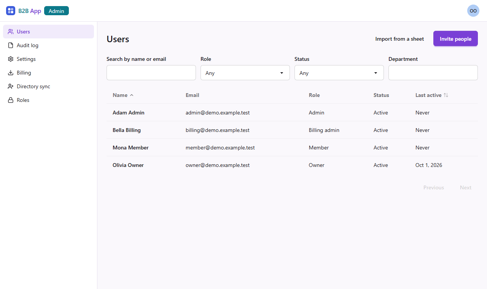

# B2B frontend template

The frontend half of an open-source starting point for multi-tenant B2B SaaS
products: the web apps for members, organization admins and the operator's
staff, a phone app and a desktop shell, already built on one set of shared
packages, so a product starts with its own features. The backend half, the
services these apps call, is
[b2b-backend-template](https://github.com/UnityEvolv/b2b-backend-template).



> **Status: preparing v0.1.0.** The first release is not out yet. The web
> apps run end to end against the backend's local stack and `npm run check`
> passes, but nothing is tagged and the APIs between the packages may still
> change. Expect changes before the release.

## What is included

- **Web apps** (React, Vite, Tailwind):
  - **account**, for every member: profile, sign-in methods and
    multi-factor authentication, sessions, notifications and their
    preferences, email change, and their own data
  - **admin**, for Owners, Admins and Billing Admins: users, invites, bulk
    import, roles and permission groups, organization settings and single
    sign-on, SCIM directory sync, billing and the audit log
  - **platform**, for the operator's own staff: every organization, its plan
    and suspension
- **Mobile app** (React Native with Expo): sign-in, multi-factor
  authentication, profile and sessions, notifications, and switching
  organization.
- **Desktop shell** (Electron) around the account app: sign-in in the
  system browser with PKCE, a URL scheme for links from emails, a tray and
  updates.
- **Shared packages:** the web shell every page renders in, session and
  auth logic for web and phone, typed API clients generated from the
  backend's OpenAPI contracts, theming and i18n.
- **Build and serving:** one Vite configuration, generated security headers,
  and an nginx image per web app.
- **An example product** (`examples/projects`) built only through the
  extension points, which CI proves can be deleted.

## What makes it different

- **The UI renders whatever the backend registers.** Plans and their
  limits, permission groups and notification categories are registered on
  the backend by the product. The Billing, Roles and notification pages ask
  the services for them when they open; there is no list of them in the
  frontend. A product adds a plan limit or a permission group on the backend
  and it appears on these pages with no frontend change.
- **Limits are read at the moment of use.** The UI never decides on its own
  that something is over the plan's cap. The server checks when the action
  happens and answers `plan.limit_reached`; the page shows the refusal and
  links to billing. A trial or an upgrade applies to the next click.
- **Anything the UI disables, the API refuses.** Hidden menu entries and
  buttons are a convenience; every service checks independently.
- **Strict security headers from configuration.** A Content Security Policy
  with no inline script beyond one hashed theme script, and camera,
  microphone and the rest denied. A product's extra origins and browser
  features are declared in one config file; the served headers are
  generated from it and CI fails on drift.
- **Guards in CI, fork-safe.** Licences (no GPL, AGPL or SSPL anywhere in
  the dependency graph), leftover identifiers, inline scripts, generated
  code drift and workflow permissions are all checked by `npm run check`,
  with no secret, so a pull request from a fork runs everything.
- **A product adds; it never edits.** Its own apps, routes, strings and live
  events plug into seams in the shared packages, so it can keep taking the
  template's fixes.

## Quick start

**The whole stack.** The backend's
[getting-started.md](https://github.com/UnityEvolv/b2b-backend-template/blob/main/docs/getting-started.md)
takes you from a clean machine to signed in, in about ten minutes, with
Docker only. Clone both repositories side by side; the backend's compose
stack builds these web apps from this checkout and serves them on
<http://localhost:5173> (account), <http://localhost:5174> (admin) and
<http://localhost:5175> (platform). The screenshot above is the admin app
from that stack, signed in as `owner@demo.example.test`.

**One web app with hot reload,** against that running stack. You need Node
22 (20 is the lowest accepted).

```sh
cd b2b-frontend-template
npm ci
# in the backend checkout, free the app's port first:
#   docker compose -f deploy/docker-compose.yml stop web-admin
npm run dev -w @b2b-template/app-admin       # http://localhost:5174
```

The dev server calls each service on the port the stack publishes for it
(`apps/admin/.env.development`). The other apps are
`@b2b-template/app-account` (5173) and `@b2b-template/app-platform` (5175).
With no backend at all, `VITE_DEV_SESSION=1 npm run dev -w
@b2b-template/app-admin` signs in a fake developer, enough to work on a
page's layout.

Before a pull request, run everything CI runs:

```sh
npm run check
```

## Naming the product

The product's identity lives in `packages/product-config`: its name and id,
the wordmark beside the logo, `logo.svg`, the prefix of every key kept on a
device, the URL scheme for the phone and desktop apps, and `webSecurity`,
the origins and browser features its pages need beyond the strict default
headers. The phone and desktop builds repeat a few of these values, and a
test fails when they drift. [docs/rebranding.md](docs/rebranding.md) lists
every value, what on the backend each must match, and a checklist.

## Documentation

| | |
| --- | --- |
| [docs/architecture.md](docs/architecture.md) | the apps and packages, `AppDefinition`, the API client, registry-driven pages, live events, i18n |
| [docs/building-an-app.md](docs/building-an-app.md) | adding a product's own web app, walking through `examples/projects`, and deleting the example |
| [docs/rebranding.md](docs/rebranding.md) | product-config, the logo, cookie names, bundle ids and the desktop scheme |
| [docs/security.md](docs/security.md) | the security headers and how a product extends them, sessions, the CI guards |
| [docs/mobile-and-desktop.md](docs/mobile-and-desktop.md) | what the phone and desktop apps do, how to run them, known gaps |
| [packages/api/README.md](packages/api/README.md) | the generated API clients, and syncing them from the backend |
| [deploy/web/README.md](deploy/web/README.md) | serving a web app: the nginx image, its headers and settings |
| [examples/projects/README.md](examples/projects/README.md) | the example product, seam by seam |
| [apps/mobile/README.md](apps/mobile/README.md), [apps/desktop/README.md](apps/desktop/README.md) | every setting of the phone and desktop apps |
| [CONTRIBUTING.md](CONTRIBUTING.md) | how to propose a change, and the architecture rules |
| [SECURITY.md](SECURITY.md) | reporting a vulnerability |

The backend's docs cover the server side:
[architecture](https://github.com/UnityEvolv/b2b-backend-template/blob/main/docs/architecture.md),
[building a product](https://github.com/UnityEvolv/b2b-backend-template/blob/main/docs/building-a-product.md),
[operations](https://github.com/UnityEvolv/b2b-backend-template/blob/main/docs/operations.md)
(deploying to Google Cloud, releases, backups),
[security](https://github.com/UnityEvolv/b2b-backend-template/blob/main/docs/security.md)
and
[rebranding](https://github.com/UnityEvolv/b2b-backend-template/blob/main/docs/rebranding.md).

## Licence

[MIT](LICENSE).
